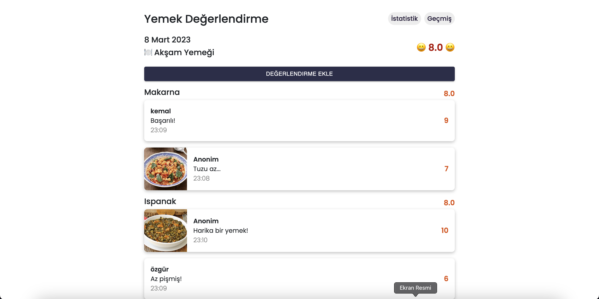
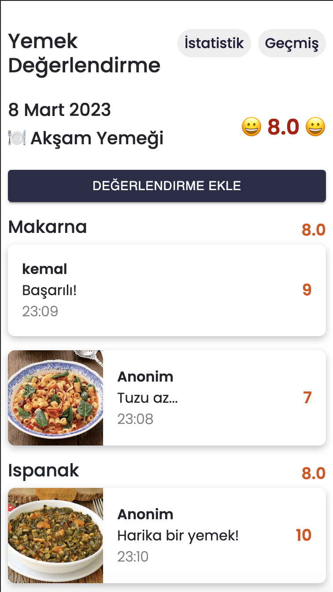
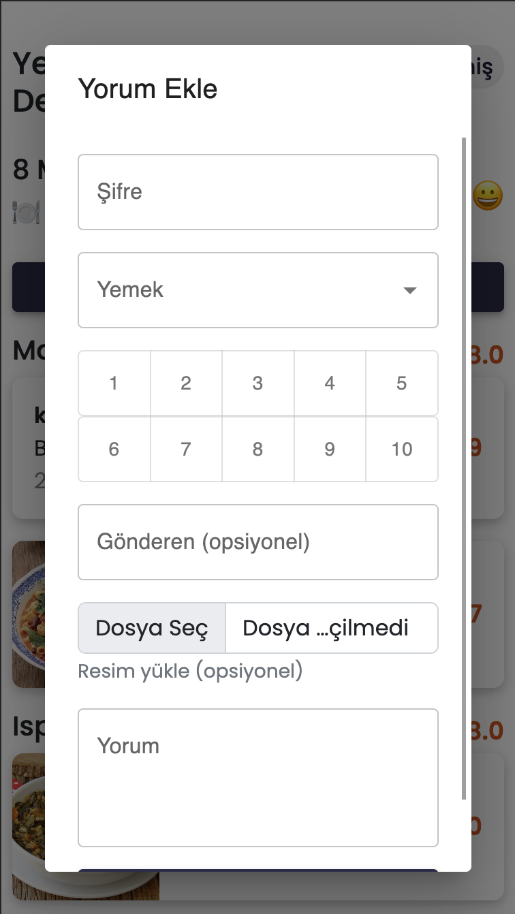
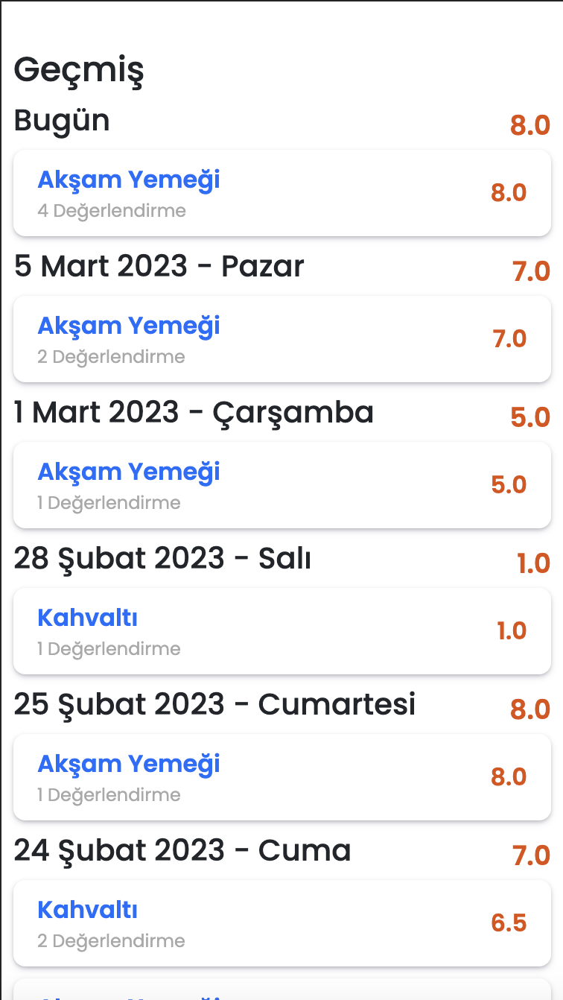

# MealRating

Meal rating app to manage reviews for an organisation foods. Users can make reviews anonymously or with their nicks. Select meal, give rate between 1-10, upload image and click send.  Also reviews are displayed by dates and meals.  There is statistic page for meals. Average rates are displayed by time and foods. 

### Tech Stack (MERN)
- MongoDb 
- Express 
- React 
- NodeJS 

Live Demo -> https://yemekdegerlendirme.web.app

### Api
**Install libraries** 
`npm install`

**Write environment variables** 
`DATABASE_URL` -> MongoDb Url 
`PORT` -> Port number where server runs

**Start server** 
`npm start`

### Frontend
**Install libraries** 
`npm install`

**Create .env in frontend root and write environment variables** 
`REACT_APP_BASE_API_URL` 
`REACT_APP_HOME_TITLE` 
`REACT_APP_INSERT_PASSWORD` 
Firebase variables for storage 
`REACT_APP_FIREBASE_API_KEY` 
`REACT_APP_FIREBASE_AUTH_DOMAIN` 
`REACT_APP_FIREBASE_PROJECT_ID` 
`REACT_APP_FIREBASE_STORAGE_BUCKET` 
`REACT_APP_FIREBASE_MESSAGING_SENDER_ID` 
`REACT_APP_FIREBASE_APP_ID` 
`REACT_APP_FIREBASE_MEASUREMENT_ID`

**Start app** 
`npm start`

### Screenshots

#### Desktop

#### Mobile
   
